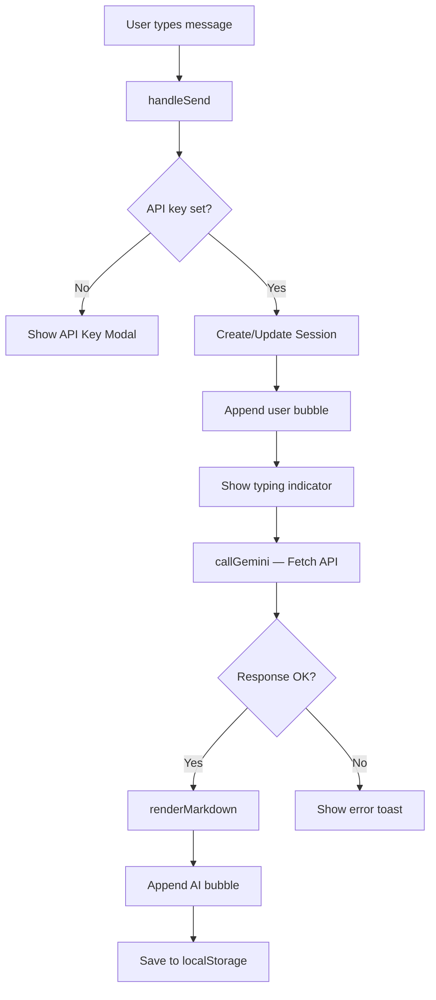

# ✦ Crystal — AI Chat Application

<div align="center">


**A stunning, dark-themed AI chat application powered by Google Gemini 2.0 Flash.**  
Ask anything. Get intelligent answers. Built with pure HTML, CSS & JavaScript — no frameworks, no build tools.

</div>

---

## 🌟 Features

| Feature | Description |
|---|---|
| 🤖 **Gemini 2.0 Flash** | Powered by Google's latest and fastest AI model |
| 🌙 **Dark Glassmorphism UI** | Premium dark theme with animated gradient orbs |
| 💬 **Multi-session History** | Create, switch between, and delete multiple conversations |
| 📝 **Markdown Rendering** | Full markdown support — code blocks, lists, headings, bold/italic |
| 📋 **Copy to Clipboard** | Copy any AI response or code block with one click |
| 💾 **Local Persistence** | All chats saved in browser localStorage — no server needed |
| 📤 **Export Chat** | Download any conversation as a Markdown file |
| ✨ **Suggestion Cards** | Quick-start prompts on the welcome screen |
| ⌨️ **Keyboard Shortcuts** | `Enter` to send · `Shift+Enter` for newline |
| 📱 **Responsive Design** | Works great on desktop and mobile |
| 🔒 **Privacy First** | API key stored only in your browser, never on any server |

---

## 🎬 Demo

> 📹 See `demo.mp4` in this repository for a full walkthrough of the app.

---

## 🚀 Getting Started

### Prerequisites

- A modern web browser (Chrome, Firefox, Edge, Safari)
- A free **Google Gemini API key** — get one at [Google AI Studio](https://aistudio.google.com/app/apikey)

### Setup (2 steps)

**1. Clone the repository**

```bash
git clone https://github.com/YOUR_USERNAME/Crystal.git
cd Crystal
```

**2. Open in browser**

```bash
# Option A — Just open the file
open index.html

# Option B — Use a local server (recommended)
npx serve .
# Then visit http://localhost:3000
```

**3. Enter your API key**

When the app opens, a dialog will ask for your Gemini API key.  
Paste your key (starts with `AIza…`) and click **"Start Chatting ✦"**.

> Your key is stored only in `localStorage` — it never leaves your browser.

---

## 🗂️ Project Structure

```
Crystal/
├── index.html      # App shell — layout, modal, welcome screen
├── style.css       # Dark glassmorphism design system
├── script.js       # All logic — API calls, sessions, markdown, UI
├── README.md       # This file
└── demo.mp4        # Video demonstration
```

---

## 🛠️ How It Works



---

## ⌨️ Keyboard Shortcuts

| Shortcut | Action |
|---|---|
| `Enter` | Send message |
| `Shift + Enter` | Add new line |

---

## 🎨 Design System

The UI is built with a custom CSS design system featuring:

- **Color palette** — Deep navy background (`#0a0a0f`) with purple accent (`#7c6fff`) and pink highlights (`#f472b6`)
- **Glassmorphism** — `backdrop-filter: blur()` on sidebar, topbar, and input area
- **Animated orbs** — Three radial gradient blobs that slowly drift in the background
- **Micro-animations** — `fadeUp` entrance, typing bounce, glow pulse, hover lifts
- **Typography** — Inter (UI) + Fira Code (code blocks) from Google Fonts

---

## 🔑 Getting a Free Gemini API Key

1. Go to [https://aistudio.google.com/app/apikey](https://aistudio.google.com/app/apikey)
2. Sign in with your Google account
3. Click **"Create API key"**
4. Copy the key (it starts with `AIza…`)
5. Paste it into Crystal when prompted

> The free tier includes generous usage limits — plenty for personal use.

---

## 📦 Tech Stack

| Technology | Purpose |
|---|---|
| HTML5 | Semantic structure, ARIA accessibility |
| CSS3 | Custom design system, animations, glassmorphism |
| Vanilla JavaScript (ES2020+) | Logic, API integration, DOM manipulation |
| Google Gemini API | AI response generation |
| localStorage | Client-side persistence (no backend) |

---

## 🤝 Contributing

Pull requests are welcome! For major changes, please open an issue first.

---

## 📄 License

MIT License — free to use, modify, and distribute.

---

<div align="center">
Made with ❤️ · Powered by <strong>Google Gemini 2.0 Flash</strong>
</div>
